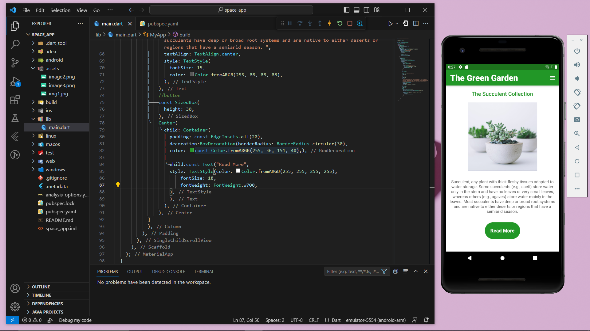

<h2># Flutter_Green_Garden_App</h2>

 

<table>
    <tr>
        <td>"The Green Garden" is a application that created with basic flutter knowledge. I have hardcode the whole application to understand the flutter widgets well.</td>
        <td></td>
    </tr>
</table>